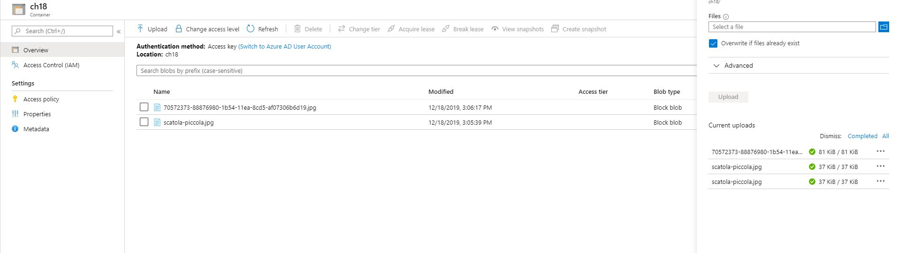

## Challenge 18

https://25daysofserverless.com/calendar/18

## Deloyed

Azure Functions URL: https://computervisionch18.azurewebsites.net

### Created ComputerVision from Azure Portal

###  Upload Image Blob in the Storage account from Azure Portal

###  Azure Functions Triggerd to analyse the Image(blob) using the Blob Trigger

